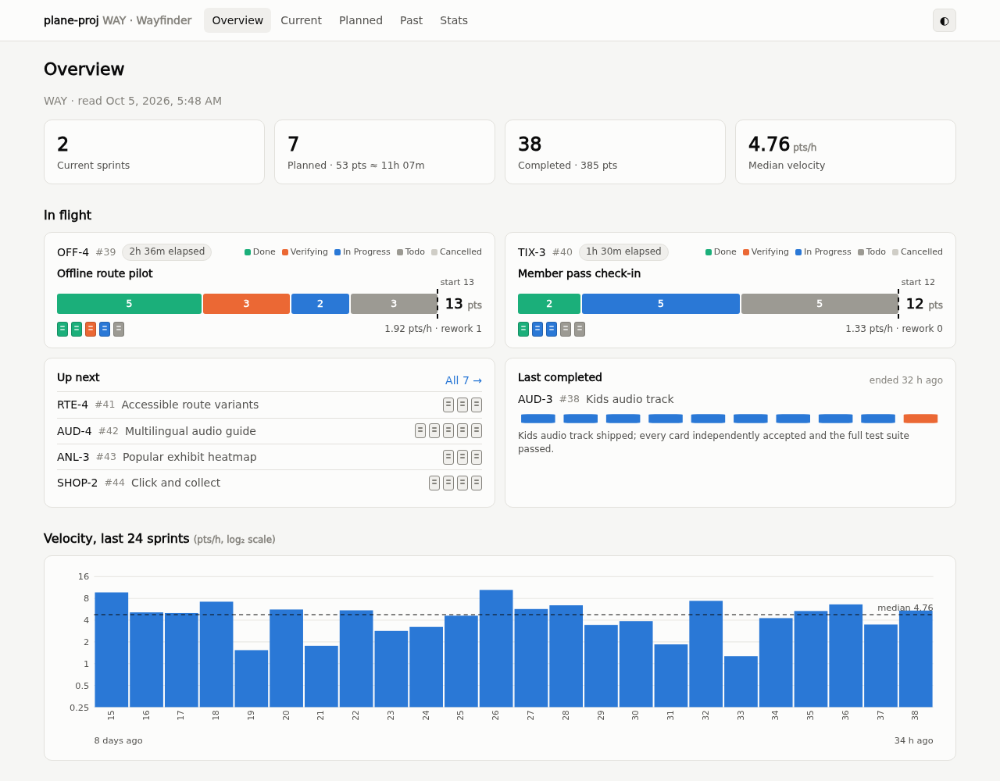
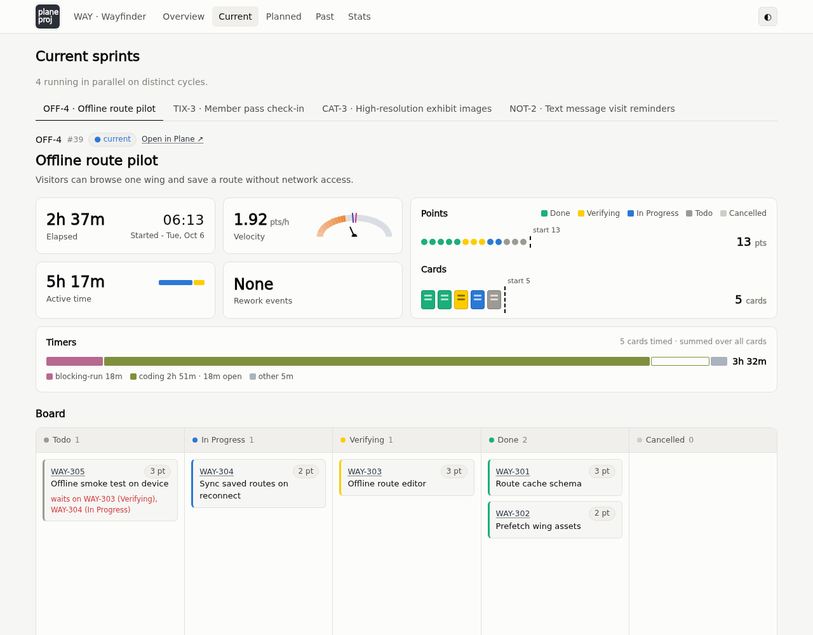
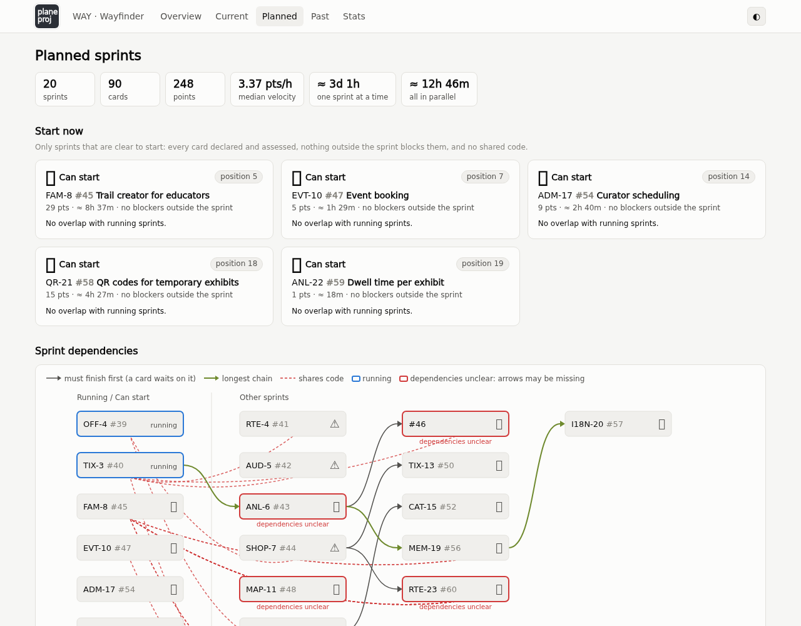
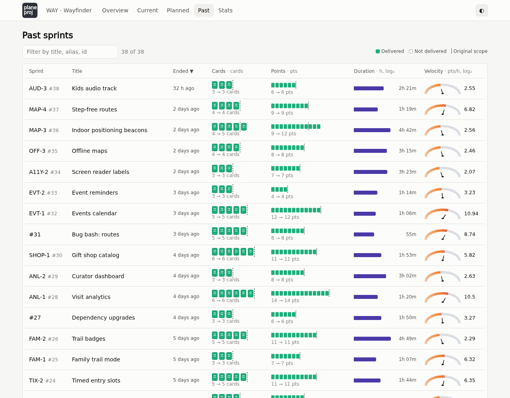
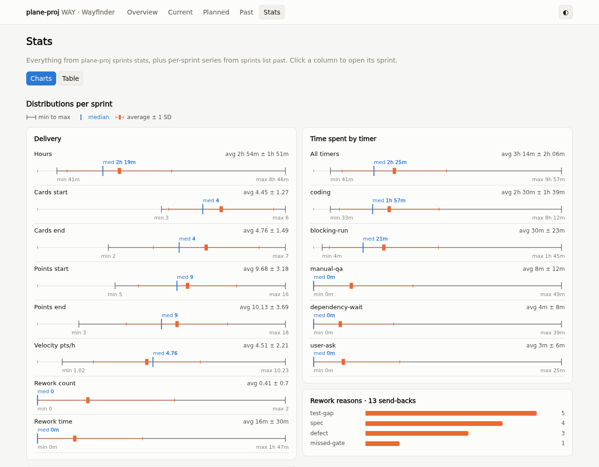

# plane-proj

`plane-proj` is a Scrum-inspired multi-agent delivery framework built around
[Plane](https://plane.so). It gives you control over how coding agents deliver
a project in parallel, and a clear view of scope, progress, verification,
timing, and delivery history, in real time, as delivery happens.



[More screenshots](docs/screenshots/README.md)

## Contents

- [What is plane-proj](#what-is-plane-proj)
- [Why plane-proj](#why-plane-proj)
- [Prerequisites](#prerequisites)
- [Install](#install)
- [Set up a project](#set-up-a-project)
- [Plan and run sprints](#plan-and-run-sprints)
- [Sprint dashboard](#sprint-dashboard)
- [Commands](#commands)
- [Development](#development)

## What is plane-proj

`plane-proj` has three parts:

- A CLI that reads and writes scrum plans on [Plane](https://plane.so) safely.
- A web dashboard that shows you what's going on, in real time.
- The `delivery-plane` agent skill, which tells your agents how to plan,
  build, review, and report, according to Scrum principles, as an agent graph,
  with checkable, measurable deliverable results, as in the Karparthy loop.

## Why plane-proj

- **You, the human, stay in charge.** You set goals, approve sprint scope, and
  decide what ships. Agents plan, build, and verify inside those limits.
- **You know what's going on.** Every work item, state change, and timer shows
  on your Plane board as agents get to work.
- **Your code is in a good state.** By breaking down work in sprints that
  deliver completed work, your code is workable and can be released.
- **You and the agent learn from each sprint.** Velocity, scope change, rework,
  and where time went are recorded for every sprint and committed with your
  code, so the next plan (by agents) is based on evidence.

### What is this NOT for

- A one-off proof-of-concept that you don't have to maintain - you don't use
  this to build something in one-shot for 30 minutes to impress people on
  Twitter.
- Research and spikes - while the skills reference them, they are best done
  off-sprints and the research written somewhere as the deliverable.

### Context clarity

This project is a form of context and graph engineering. For a large project, a
single agent or a swarm of undifferentiated agents can struggle to handle
multiple tasks at once: implement disparate systems from front end, back end,
data processing, testing, to reporting to user coherently.

By breaking up implementation into clearly defined roles, agent context becomes
clear and coherent:

- The coordinator reports to me in human language, not some jargon-filled prose
  that always results after working in code for extended periods of time.
- The tech lead handles overall tech design.
- Builders write code and deal with the minutiae of code syntax.
- QA and adversarial reviewers check design and code for issues.

These roles then hand the task off to each other to complete delivery, in a
graph formation.

### Breaking down large projects into Sprints

A naive way of breaking down a large project is into a long list of tasks. You
may then put this into a kanban board.

The problem: this often becomes an **endless list of TODOs**. You need a
structure for the backlog of tasks.

The driver for adapting Scrum for agent coordination is not to anthropomorphize.

I was a Certified Scrum Master and a Certified Scrum Product Owner. I used to
train large corporations on how to use Scrum. Results with people are sometimes
mixed. But I wonder if I could use it with AI agents when I encountered issues
with their executions on large projects, because while the results are mixed,
the framework makes sense if it's used diligently.

When I adapted [Scrum](https://scrumguides.org/scrum-guide.html) as an
experiment for my own projects, it worked exceedingly well. Better than human
teams, in fact, because Scrum requires a certain discipline in people, which not
everyone has. Agents are very good at following orders, especially when you give
the orders in normative language. Best of all, what used to take 2 weeks can now
take hours.

| Topic | Traditional Scrum | plane-proj |
| --- | --- | --- |
| Sprint | Fixed; often 2 weeks | Usually 1–8 hours |
| Team | Stable roles and size | Coordinator, Tech Lead, and QA, with agents that come and go |
| Product Owner | Required | You |
| Scrum Master | Full-time role | Coordinator agent |
| Daily Scrum | Daily 15-minute event | None; the live board replaces it |
| Review | End-of-sprint review | You review at will |
| Estimates | Team-defined | Fibonacci points; 1–3 normal |

## Prerequisites

1. Create a [Plane](https://plane.so) account, or have a reachable self-hosted
   Plane instance.
2. Create a workspace and project.
3. Create a personal access token under **Profile settings → Personal access
   tokens**.
4. Create `.env_plane` in your project directory:

```dotenv
PLANE_API_HOST_URL=https://api.plane.so
PLANE_API_KEY=your-personal-access-token
PLANE_WORKSPACE_SLUG=my-workspace
```

For Plane Cloud, the API host is `https://api.plane.so`, not
`https://app.plane.so`. For self-hosted Plane, use the base URL of your
instance. The workspace slug is the workspace part of the Plane URL.

Never commit `.env_plane`.

## Install

Run directly from GitHub with `uvx`:

```sh
uvx --from git+https://github.com/OWNER/plane-proj.git plane-proj --help
```

For a persistent `plane-proj` command:

```sh
uv tool install git+https://github.com/OWNER/plane-proj.git
```

Or install the Nix package:

```sh
nix profile install github:OWNER/plane-proj
```

Install the delivery skill for your coding agents:

```sh
npx skills add OWNER/plane-proj --skill delivery-plane
```

Add `--global` to install the skill for all projects. Review the skill before
installing it; agent skills are instructions your agent will follow.

## Set up a project

### 1. Initialize

```sh
plane-proj init --project DEMO
```

Use `--env-file PATH` when your credentials file has another name. `init`
creates:

| File | Purpose | Git |
| --- | --- | --- |
| `.env_plane` | Plane URL, workspace slug, and API key | **Never commit** |
| `plane/plane-proj.json` | Project selection, estimate mapping, and rules | **Commit** |
| `plane/SPRINTS.sqlite` | Sprint plans, history, and timing | **Commit** |
| `.gitattributes` | Register merge driver and diff view (in a git repo) | **Commit** |

```sh
git add plane/plane-proj.json plane/SPRINTS.sqlite .gitattributes
git commit -m "Initialize plane-proj delivery"
echo ".env_plane*" >> .gitignore
```

Inside a git repository, `init` also sets up git to merge the sprint register
when sprints run on different branches. In an existing project, or after a
fresh clone, run `plane-proj register git-setup` once. Commit the
`.gitattributes` change it makes.

plane-proj commits the register itself after every command that writes it,
staging nothing else. Only plane-proj can write it: a raw SQLite write fails.
Never checkout, restore or stash the register.

### 2. Prepare Plane

- Add a `Verifying` state in Plane's `Started` state group.
- Enable **Modules** and **Intake** if you use them.
- Optionally give agents their own Plane account with Member access. Make it a
  Project Admin if agents should accept or reject Intake items.
- Optionally configure a numeric **Points** estimate scale.

### 3. Set up estimation (optional)

Some Plane servers do not let `plane-proj` read the point values of an
estimate scale directly. To capture them, create one temporary card per point
value (for `1, 2, 3, 5, 8, 13, 21, 34, 55`, nine cards), give each a different
estimate, then run:

```sh
plane-proj project scale --write
plane-proj project scale
```

Once the scale is saved, delete the temporary cards in Plane.

### 4. Check project rules

`plane/plane-proj.json` holds your project rules: cycle, module, estimate,
work-in-progress, and card size limits, plus whether a card needs passing QA
and Tech Lead verdicts before Done (`require_independent_verdicts`), must follow
the allowed state flow (`require_transition_table`), must declare touched files
and dependency assessment (`require_delivery_plan`), and must stay within its
declared scope (`require_declared_scope`). Projects can also set
`defaults.integration_branch` for scope reports and top-level `shared_paths` for
files every card changes for mechanical reasons (such as `pyproject.toml` or
`uv.lock`) that stay in scope without declaration and never cause parallel
sprint overlap. Check the board against them:

```sh
plane-proj project rules-check
```

## Plan and run sprints

You direct the agents; the `delivery-plane` skill tells them how to work.

1. **Gather work.** Use a research write-up for a new feature, or file bugs
   and suggestions with `plane-proj intake new` and accept the ones you want.
2. **Plan.** Ask the Coordinator and Tech Lead agents to break the work into
   small, estimated cards and group them into sprints. Every card declares
   each file it touches (`--touches`, one file per flag; mark files it creates
   `(new)`; directories are refused) and that dependencies were assessed
   (`--deps-assessed`) via `card new` or `card plan`.
3. **Approve.** Review the planned sprints with `plane-proj sprints list
   planned` or the dashboard, and reorder them as you like.
4. **Run.** Tell the Coordinator to start the next sprint. Builders add `Card:
   <CARD_REF>` trailers to every commit. Before closure, the Coordinator checks
   readiness (`READY` vs `NOT READY`) and the scope report with `plane-proj
   sprints preflight`.
5. **Review.** When a sprint closes, read what was delivered and the
   retrospective, and adjust the next plan.

## Sprint dashboard

```sh
plane-proj sprints web
```

Open <http://127.0.0.1:8765>. The dashboard updates as sprints change. Links
open Plane at `defaults.web_url` in `plane/plane-proj.json`, which `init` sets
to `https://app.plane.so`; with a self-hosted Plane, change it to your
server's address.

| Current sprint | Planned sprints |
| --- | --- |
|  |  |

| Past sprints | Statistics |
| --- | --- |
|  |  |

See [all dashboard screenshots](docs/screenshots/README.md).

### Try the dashboard without Plane

`demo/run_demo.py` shows the dashboard for Wayfinder, an invented museum
guide project, without Plane, a register, or credentials. Run it from a
clone, in the development shell (see [Development](#development)):

```sh
python demo/run_demo.py
```

It writes a static site to `demo/site`, then serves it at
<http://127.0.0.1:8780>; `--host`, `--port` and `--out` change those. To
publish the demo, upload that folder to any static web host, such as GitHub
Pages.

## Commands

Run `plane-proj COMMAND --help` for options. Put `--json` before the command
for machine-readable output.

### Setup and project

| Command | Purpose |
| --- | --- |
| `init --project KEY` | Create credentials, config, and sprint register |
| `register git-setup` | Let git merge and diff the register via `register merge` and `register dump` |
| `projects [--all]` | List Plane projects |
| `project states` | List workflow states |
| `project modules` | List modules |
| `project cycles` | List cycles |
| `project members` | List members |
| `project scale [--write]` | Show or save the estimate scale |
| `project rules-check` | Check cards against project rules |

### Cards

| Command | Purpose |
| --- | --- |
| `card list` | List active cards; `--state` shows Done, Backlog, or Cancelled; `--sprint` lists every card in a sprint's cycle |
| `card show CARD` | Show a card with relations, description, and attachments |
| `card new ... --cycle CYCLE` | Create a card in a sprint's cycle; `--touches` and `--deps-assessed` declare scope |
| `card plan CARD` | Replace only the Delivery plan section of an existing card |
| `card set CARD ...` | Change title, description, owner, or priority |
| `card move CARD STATE` | Move a card to a state |
| `card move-many ...` | Move up to 20 cards |
| `card estimate CARD N` | Set an estimate |
| `card set-cycle CARD CYCLE` | Move a card to another cycle |
| `card comment CARD` | Post a Markdown comment from stdin |
| `card comments CARD` | Read comments |
| `card timeline CARD` | Show state changes and timers |
| `card stats CARD` | Show time in each state, timers, and rework |

### Intake and dependencies

| Command | Purpose |
| --- | --- |
| `intake new --title TITLE` | File a bug report or suggestion |
| `intake list` | List pending Intake items |
| `intake accept ITEM` | Accept an item into the project |
| `intake reject ITEM` | Reject an item |
| `rel add CARD blocked_by CARD` | Add a dependency |
| `rel list CARD` | List a card's dependencies |

### Cycles and modules

| Command | Purpose |
| --- | --- |
| `cycle list` | List cycles |
| `cycle cards CYCLE` | List a cycle's cards |
| `module list` | List modules |
| `module cards MODULE` | List a module's cards |

### Sprints

| Command | Purpose |
| --- | --- |
| `sprints list [current\|planned\|past]` | List sprints |
| `sprints show [N]` | Show one sprint, or the current ones |
| `sprints stats` | Summarize completed sprints |
| `sprints web` | Open the sprint dashboard |
| `sprints plan --id N ...` | Create or replace a planned sprint and create or update its Plane cycle |
| `sprints preflight SPRINT_ID` | Report closure readiness, accounting, and integration branch scope report |
| `sprints reorder ID...` | Set the order of planned sprints |
| `sprints alias ID ALIAS` | Give a sprint a short name, such as `WEB-1` |
| `sprints check` | Find cards that belong to no sprint |
| `sprints ready` | List cards that can start now, in any sprint |
| `sprints critical-path` | Show the longest dependency chain and how much parallel work can help |
| `sprints start ID` | Start a planned sprint using the current time |
| `sprints close N --ended TIME --delivered TEXT` | Close a finished sprint |

Agents use further commands for timers, evidence, and telemetry; see
`plane-proj --help`.

## Development

Nix supplies Python and `uv` manages dependencies:

```sh
git clone https://github.com/OWNER/plane-proj.git
cd plane-proj
direnv allow
```

Before committing code:

```sh
pytest
ruff check .
rumdl check .
```

The development shell points git at `.githooks/pre-commit`, which refuses
commits whose staged Python files fail `ruff check` or staged Markdown files
fail `rumdl check`. Clean commits succeed, and unstaged or untracked files with
findings do not block the commit.

After changing `pyproject.toml` or `uv.lock`, also run:

```sh
nix build .#plane-proj
```

Refresh dependencies with `uv lock`; do not use `pip install`.

See [DESIGN.md](DESIGN.md) for architecture and design decisions.

---

**This file is:** How to use and develop plane-proj, and why it is useful.
**Form:** How-to for people. No specification, no history, no status. Never
any agent notes.
