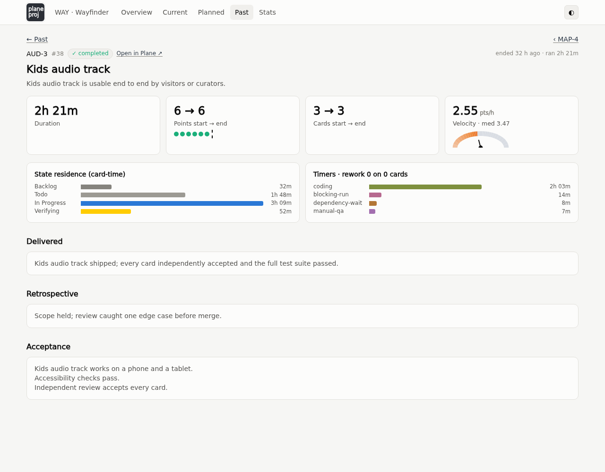

# Sprint dashboard screenshots

`plane-proj sprints web` serves these screens. They show an invented project,
Wayfinder, an offline museum guide app.

- [Overview](#overview)
- [Current sprints](#current-sprints)
- [Planned sprints](#planned-sprints)
- [Past sprints](#past-sprints)
- [Sprint detail](#sprint-detail)
- [Statistics](#statistics)

## Overview

Running sprints with their progress, what comes next, the last completed
sprint, and recent velocity.

## Current sprints

One tab per sprint when several run in parallel. Points and cards by state,
the board with what each card waits on, velocity, rework, active time, timers,
and acceptance.

## Planned sprints

The queue in execution order with cards, points, and estimated hours, plus the
critical path across sprints on request.

## Past sprints

Every completed sprint at a glance: when it ended, how long it ran, cards and
points with scope added or removed, and velocity.

## Sprint detail

One completed sprint: duration, scope, velocity, where time went, rework, what
was delivered, and the retrospective.

## Statistics

Distributions across completed sprints and per-sprint charts for points,
cards, velocity, duration, timers, active time, and rework.

---

**This file is:** A gallery of the sprint dashboard for people.
**Form:** Screenshots with short captions. No specification, no history, no
status.
